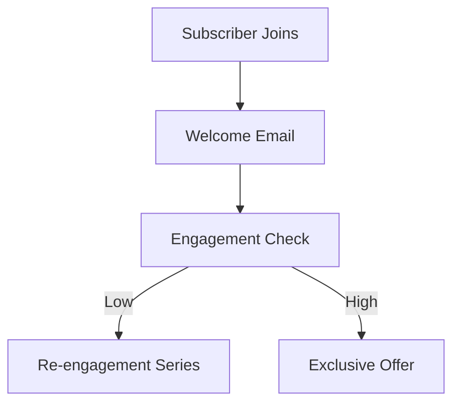

## Overview

TinyEmail provides powerful tools to help you connect with your audience through targeted email campaigns. You can manage contacts, design professional emails, capture leads with forms, and track performance with built-in analytics. These core features enable you to deliver more emails that land in inboxes and drive growth.

<Callout kind="info">
Focus on one feature at a time to maximize your setup efficiency. Start with audience management before building campaigns.
</Callout>

## Key Features at a Glance

<Columns cols={2}>
  <Card title="Audience Management" icon="users" href="#audience-management">
    Segment and import contacts easily to target the right people.
  </Card>
  <Card title="Campaign Creation" icon="mail" href="#campaign-creation">
    Build automated workflows for newsletters and promotions.
  </Card>
  <Card title="Form Builders" icon="form-input" href="#form-builders">
    Capture leads directly on your site or landing pages.
  </Card>
  <Card title="Template Tools" icon="layout" href="#template-tools">
    Customize designs without coding skills.
  </Card>
</Columns>

## Audience Management

Build and segment your contact lists to send personalized emails. TinyEmail supports importing from CSV files, direct API integrations, or third-party services.

### Import Options

<Tabs>
  <Tab title="CSV Upload" icon="upload">
    Prepare your contacts in a spreadsheet with columns for email, name, and custom fields.
    
    <Steps>
      <Step title="Prepare File">
        Ensure your CSV uses UTF-8 encoding and includes headers like `email`, `first_name`.
      </Step>
      <Step title="Upload">
        Navigate to Audience > Import > Upload CSV and select your file.
      </Step>
      <Step title="Map Fields">
        Match CSV columns to TinyEmail fields and review for duplicates.
      </Step>
    </Steps>
  </Tab>
  <Tab title="API Import" icon="code">
    Use the API to sync contacts programmatically.
    
````jsx
<CodeGroup tabs="JavaScript,Python">
```javascript
const response = await fetch('https://api.example.com/v1/contacts', {
  method: 'POST',
  headers: {
    'Authorization': 'Bearer YOUR_API_KEY',
    'Content-Type': 'application/json'
  },
  body: JSON.stringify({
    email: 'user@example.com',
    name: 'John Doe',
    tags: ['vip']
  })
});
```
```python
import requests

response = requests.post(
  'https://api.example.com/v1/contacts',
  headers={
    'Authorization': 'Bearer YOUR_API_KEY',
    'Content-Type': 'application/json'
  },
  json={
    'email': 'user@example.com',
    'name': 'John Doe',
    'tags': ['vip']
  }
)
```
</CodeGroup>
````
  </Tab>
</Tabs>

<ParamField path="email" param-type="string" required="true">
  Unique subscriber email address.
</ParamField>

<ParamField query="tag" param-type="string" required="false">
  Tags for segmentation.
</ParamField>

## Campaign Creation

Create newsletters, automations, and one-off sends with drag-and-drop builders.

<Expandable title="Automation Workflows" default-open="true">
Automations trigger emails based on user actions like sign-ups or purchases.



Set up in Campaigns > Automations by selecting triggers and designing sequences.
</Expandable>

## Form Builders

Embed subscription forms on your website to grow your list.

<Tabs>
  <Tab title="Embed Code" icon="code">
    Generate and paste this snippet into your HTML.
    
````html
<div id="tinyemail-form"></div>
<script src="https://app.tinyemail.com/embed.js"></script>
<script>
  TinyEmail.init('YOUR_FORM_ID');
</script>
````
  </Tab>
  <Tab title="Link Sharing" icon="link">
    Share a direct form URL on social media or ads.
  </Tab>
</Tabs>

## Template Customization

Access a library of responsive templates and edit with a visual editor.

### Quick Customization Steps

<Steps>
  <Step title="Select Template" icon="layout">
    Choose from gallery or start blank.
  </Step>
  <Step title="Drag and Drop">
    Add blocks for text, images, buttons.
  </Step>
  <Step title="Personalize">
    Insert merge tags like `{first_name}` for dynamic content.
  </Step>
  <Step title="Preview and Test">
    Send test emails to verify rendering.
  </Step>
</Steps>

<Callout kind="tip" title="Pro Tip">
Use A/B testing on subject lines and content to boost open rates by up to 30%.
</Callout>

## Analytics and Next Steps

Track opens, clicks, and bounces in real-time dashboards. Dive deeper with [audience segmentation](#audience-management) or explore [campaign automations](#campaign-creation).

<Columns cols={3}>
  <Card title="Quickstart" icon="rocket" href="/quickstart">
    Set up your first campaign.
  </Card>
  <Card title="Authentication" icon="shield" href="/authentication">
    Secure your API access.
  </Card>
  <Card title="FAQ" icon="help-circle" href="/faq">
    Common questions answered.
  </Card>
</Columns>